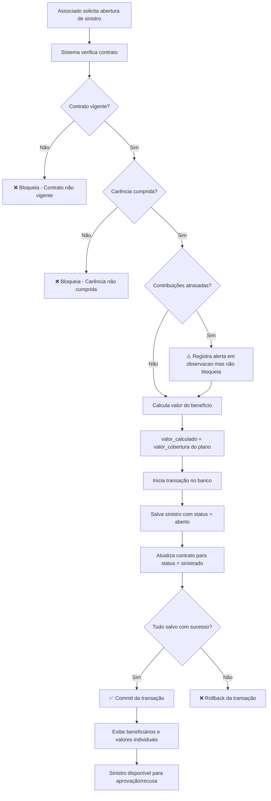

# Sistema de Pecúlios — Caixa de Assistência Militar

Sistema desenvolvido em CakePHP 5 para gestão de pecúlios de associados militares.

## Tecnologias

- PHP 8.5
- CakePHP 5.3
- MySQL 8
- XAMPP

## Instalação

```bash
# 1. Clone o repositório
git clone https://github.com/miguelpxt20/Peculios.git
cd Peculios

# 2. Instale as dependências
composer install

# 3. Configure o banco de dados
cp config/app_local.example.php config/app_local.php
# Edite config/app_local.php com suas credenciais

# 4. Crie o banco de dados
# Acesse o MySQL e crie o banco: peculios_db

# 5. Execute as migrations
php bin/cake.php migrations migrate

# 6. Execute os seeds
php bin/cake.php seeds run

# 7. Inicie o servidor
php bin/cake.php server
```

Acesse: http://localhost:8765

---

## Fluxograma — Abertura de Sinistro



---

## Decisões Técnicas

### Por que DECIMAL e não FLOAT para valores financeiros?

O tipo `FLOAT` armazena números em ponto flutuante binário, o que causa erros de arredondamento. Por exemplo, `0.1 + 0.2` em FLOAT pode resultar em `0.30000000000000004`. Em um sistema financeiro isso é inaceitável — um centavo de diferença em milhares de registros gera inconsistências graves.

O tipo `DECIMAL(15,2)` armazena valores exatos com precisão definida, garantindo que `R$ 100.000,00` seja sempre `100000.00`, sem surpresas de arredondamento.

### Como foi garantido que os percentuais de beneficiários somam 100%?

A constraint foi implementada em duas camadas:

1. **Banco de dados**: o campo `percentual` usa `DECIMAL(5,2)`, limitando valores entre 0 e 100.
2. **Aplicação**: a validação no model verifica que a soma dos percentuais de todos os beneficiários de um contrato é exatamente 100% antes de salvar.

### Estratégia para registro do histórico de contribuições

Cada contribuição é um registro independente na tabela `contribuicoes`, com:
- `contrato_id` — referência ao contrato
- `competencia` — mês de referência no formato `YYYY-MM-01`
- `status` — pendente, paga, atrasada ou cancelada

Um índice único em `(contrato_id, competencia)` garante **idempotência**: não é possível lançar duas contribuições para o mesmo contrato no mesmo mês. O lançamento em lote usa `saveMany()` para inserir todos os registros em uma única operação, evitando N queries.

### Como o status do contrato muda ao longo do ciclo de vida?

| Status | Quando ocorre |
|---|---|
| `vigente` | Ao criar o contrato |
| `suspenso` | Quando o associado solicita suspensão temporária |
| `encerrado` | Quando o contrato é cancelado voluntariamente |
| `sinistrado` | Automaticamente ao aprovar a abertura de um sinistro |

A mudança para `sinistrado` ocorre dentro de uma **transação atômica** junto com a criação do sinistro, garantindo que nunca exista um sinistro sem o contrato correspondente atualizado.

---

## Estrutura do Projeto

```
src/
├── Controller/
│   ├── AssociadosController.php
│   ├── ContratosPeculioController.php
│   ├── ContribuicoesController.php
│   ├── SinistrosController.php
│   ├── PlanosPeculioController.php
│   └── BeneficiariosController.php
├── Model/
│   ├── Table/
│   └── Entity/
templates/
├── Associados/
├── ContratosPeculio/
├── Contribuicoes/
├── Sinistros/
└── Pages/
config/
├── Migrations/
└── Seeds/
```